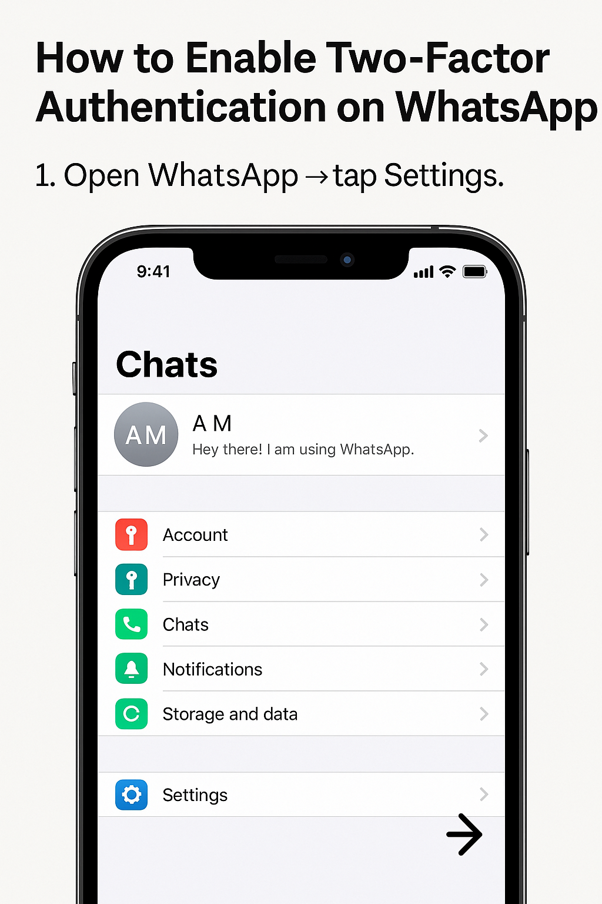
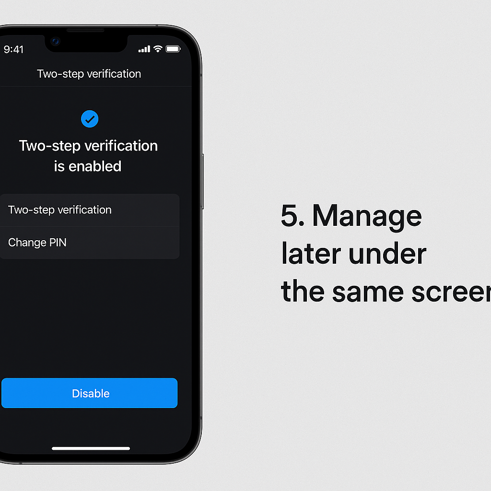

> Use the collapsible sections below. Each step includes an **image slot** you can fill with your own screenshots.  
> Tip: Prefer an **authenticator app** over SMS whenever possible.

### Quick Start 
1. **WhatsApp** → Settings → **Account** → **Two-step verification** → **Turn on** → set 6-digit **PIN** → add **email** for recovery.  
2. **Instagram** → Profile → Menu → **Accounts Center** → **Password and security** → **Two-factor authentication** → choose **Authentication app** (or WhatsApp/SMS) → save **backup codes**.  
3. **Facebook** → Menu → **Settings & privacy** → **Settings** → **Accounts Center** → **Password and security** → **Two-factor authentication** → pick **Authentication app**, **Text message**, or **Security key** → save **recovery methods**.  

---
## (Press on Open to see article)
### WhatsApp: Turn on Two-Step Verification

<strong>Open (Android & iPhone)</strong>

1. **Open WhatsApp** → tap **Settings**.  
   

2. Go to **Account** → **Two-step verification**.  
   

3. Tap **Turn on** → choose a **6-digit PIN**.  
   

4. Add a **recovery email** (recommended).  
   

5. Manage later under the same screen.  
   

---

### Instagram: Turn on Two-Factor Authentication

<strong>Open (Android, iPhone & Web)</strong>

1. Go to **Profile** → Menu → **Accounts Center**.  
   

2. Tap **Password and security** → **Two-factor authentication**.  
   

3. Choose a method:  
   - **Authentication app** (recommended)  
   - **WhatsApp** or **Text message**  
   

4. **Save backup codes**.  
   

5. Manage trusted devices.  
   

---

### Facebook: Turn on Two-Factor Authentication (+ Security Keys)

<strong>Open (Android, iPhone & Web)</strong>

1. Tap **Menu** → **Settings & privacy** → **Settings** → **Accounts Center**.  
   

2. Go to **Password and security** → **Two-factor authentication**.  
   

3. Choose your method:  
   - **Authentication app**  
   - **Text message (SMS)**  
   - **Security key (USB/NFC)**  
   

4. Save recovery/backup options.  
   

5. (Optional) Set **Login alerts**.  
   

---

### Best Practices (All Three)

- Prefer an **authenticator app** to SMS.  
- **Store backup codes** offline.  
- Never share **verification codes** with anyone.  

---

### Recovery & Troubleshooting

#### Facebook  
- Try alternate methods (authenticator, SMS, security key).  
- Check **Login alerts** and recovery options.  

#### Instagram  
- Use **backup codes** or trusted devices.  
- Keep email/phone access updated.  

#### WhatsApp  
- Reset your **PIN** with the recovery email.  
- If no email was set, wait for the cooldown period.  

---

### Image Checklist

- **WhatsApp:** 5 slots (Settings → Account → PIN → Email → Manage)  
- **Instagram:** 5 slots (Accounts Center → Security → Method → Backup → Devices)  
- **Facebook:** 5 slots (Accounts Center → Security → Method → Backup → Alerts)  

---

### FAQ

<strong>Which method is safest?</strong>

Use an **authenticator app** or **security key**. SMS is least secure.  

<strong>Do I need to set this up on every device?</strong>

No—approve trusted devices as you log in.  

<strong>Can I turn it off later?</strong>

Yes—go back into **2FA settings** to disable.  
