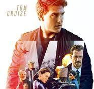

# Mission Impossible: A Franchise That Redefined Action Cinema

The **Mission Impossible** franchise, led by *Tom Cruise*, is not just a series of action movies—it’s a cultural phenomenon that has spanned decades, redefined stunt work, and set new benchmarks for spy thrillers.

From *Brian De Palma’s* 1996 classic to *Christopher McQuarrie’s* latest blockbusters, the franchise has grown into a **$3.5 billion global phenomenon**, blending high-tech espionage with jaw-dropping practical stunts.

---

## 🔥 Franchise Highlights

- 🎬 **7 Films Released** (1996 – 2023) with the 8th on the way.  
- 🏍️ **Tom Cruise’s Real Stunts** – From scaling the Burj Khalifa to clinging onto an Airbus A400M.  
- 💥 **Box Office Success** – Each film grossing hundreds of millions worldwide.  
- 📺 **Roots in a 1966 TV Show** – Inspired by the original *Mission: Impossible* series.  
- 🎶 **Iconic Theme Music** – Lalo Schifrin’s legendary theme remains unforgettable.  
- 🌍 **Global Filming Locations** – From Prague to Abu Dhabi to Norway.  

---

## 🎥 Timeline of Mission Impossible Films

### 1. *Mission: Impossible* (1996)  
Directed by Brian De Palma – Introduced Ethan Hunt (Tom Cruise) and gave us the legendary **wire-drop CIA heist scene**.

### 2. *Mission: Impossible II* (2000)  
Directed by John Woo – Known for stylized action, slow-motion gunfights, and *flaming motorcycles*.

### 3. *Mission: Impossible III* (2006)  
Directed by J.J. Abrams – Raised the emotional stakes with Philip Seymour Hoffman as one of the franchise’s most chilling villains.

### 4. *Mission: Impossible – Ghost Protocol* (2011)  
Directed by Brad Bird – Famous for Cruise **scaling the Burj Khalifa**, the tallest building in the world.

### 5. *Mission: Impossible – Rogue Nation* (2015)  
Directed by Christopher McQuarrie – Featured the **airplane stunt**, where Cruise hung onto a real Airbus during takeoff.

### 6. *Mission: Impossible – Fallout* (2018)  
Directed by McQuarrie – Praised for breathtaking action, including a **HALO jump** and helicopter chase.

### 7. *Mission: Impossible – Dead Reckoning Part One* (2023)  
McQuarrie delivers once again with a motorcycle jump off a cliff—done **without CGI**.

### 8. *Mission: Impossible – Dead Reckoning Part Two* (2025) *(Upcoming)*  
Expected to conclude Ethan Hunt’s journey in a spectacular finale.

---

## 🕵️ Why Mission Impossible Stands Out

- **Practical Stunts > CGI** – Audiences trust the authenticity.  
- **Strong Storytelling** – Espionage, betrayal, and team dynamics keep fans hooked.  
- **Consistency** – Tom Cruise has stayed dedicated for almost 30 years.  

---

## 📌 Related Links
- [Mission Impossible IMDb Page](https://www.imdb.com/title/tt0117060/)  
- [Tom Cruise Biography](https://en.wikipedia.org/wiki/Tom_Cruise)  
- [Mission Impossible Franchise Wikipedia](https://en.wikipedia.org/wiki/Mission:_Impossible_(film_series))  

---

## 🧩 Final Thoughts

The **Mission Impossible** saga isn’t just about explosions and gadgets—it’s about a relentless commitment to pushing cinematic boundaries. With *Dead Reckoning Part Two* coming soon, fans are bracing for one last, impossible ride. 🚀  

---

