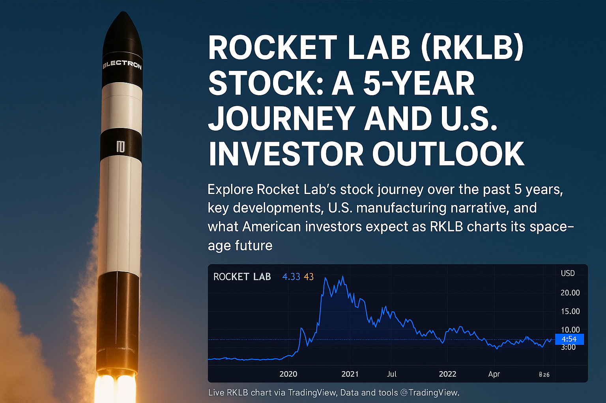

# Rocket Lab (RKLB): A U.S. Space Stock on the Move

Rocket Lab USA Inc. (NASDAQ: RKLB) has captured investor imagination as one of the few U.S.-based commercial space companies with regular launch capability. Over the last five years, RKLB has offered investors a mix of **volatile price swings**, **innovative technology milestones**, and **U.S. strategic alignment**.  

---

## 1. 5-Year Stock Performance

- **IPO (via SPAC in 2021):** Opened around $10.  
- **All-Time High:** Near $20 in late 2021.  
- **2022–2023:** Significant drawdown, trading below $5.  
- **2024–2025:** Stabilization with revenue growth, now hovering near $7–$8 range.  

<section id="live-rklb-chart" style="margin:1.25rem 0;">
  <iframe
    title="RKLB Live Chart"
    src="https://s.tradingview.com/widgetembed/?symbol=NASDAQ%3ARKLB&interval=D&hidesidetoolbar=1&hidetoptoolbar=1&symboledit=1&saveimage=0&toolbarbg=fff&theme=light&style=1&timezone=Etc/UTC&withdateranges=1&hideideas=1&enable_publishing=0&allow_symbol_change=1&details=1&calendar=1"
    width="100%" height="520" frameborder="0" allowtransparency allowfullscreen
  ></iframe>
  
Live RKLB chart via TradingView.

</section>

<section id="rklb-stats" style="border:1px solid #e5e7eb;border-radius:12px;padding:16px;margin:1.25rem 0;">
  <h3>RKLB — 5-Year Snapshot</h3>
  <ul>
    <li><strong>5Y Range:</strong> $3 – $20</li>
    <li><strong>Current Price:</strong> ~$7.5 (Aug 2025)</li>
    <li><strong>5Y Return:</strong> -25% vs Nasdaq +65%</li>
    <li><strong>Volatility:</strong> High (space sector cyclical)</li>
  </ul>
  
Source: Yahoo Finance, TradingView

</section>

---

## 2. Rocket Lab’s Growth Drivers

### Launch Cadence
- Over **70 successful Electron launches** completed by mid-2025.  
- Consistent small-satellite delivery builds trust in the U.S. defense and private sectors.  

### Neutron Rocket Development
- Medium-lift **Neutron rocket** scheduled for first flight in **2026**.  
- Seen as the make-or-break project that could open access to bigger NASA, DoD, and commercial contracts.  

### Government & Defense Contracts
- Multiple U.S. Department of Defense and NASA partnerships.  
- Focus on **sovereign manufacturing** aligns with Washington’s push to secure supply chains.  

### Space Systems Expansion
- Satellite components, propulsion, and space manufacturing diversifying revenue.  
- Targeting recurring income beyond launch.  

---

## 3. What U.S. Investors Want from RKLB

| Investor Focus | Why It Matters |
|----------------|----------------|
| **Execution on Neutron** | Determines long-term competitiveness vs. SpaceX & ULA. |
| **Contract Wins** | Regular government contracts = stable revenue base. |
| **Profitability Roadmap** | Moving from R&D heavy losses to free cash flow positive. |
| **Made in America** | U.S. investors favor domestic space manufacturing resilience. |
| **Stock Stability** | Desire for reduced volatility and long-term returns. |

---

## 4. Outlook

Analysts remain split:  
- **Bullish View:** RKLB could trade above $15 again if Neutron succeeds and contracts scale.  
- **Bearish View:** Execution risks and funding dilution may keep shares in the single digits.  

For U.S. investors, Rocket Lab is **not just a stock but a bet on the commercialization of space**. Unlike speculative peers, it has proven launch cadence, but the next few years will test whether it can scale sustainably.  

---

*This article is for educational purposes only. It is not financial advice. Please consult a licensed advisor before investing.*
